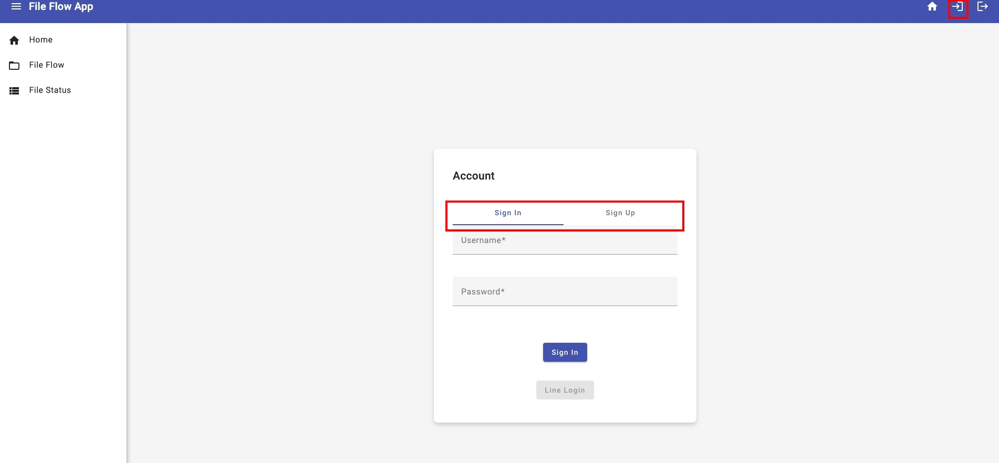
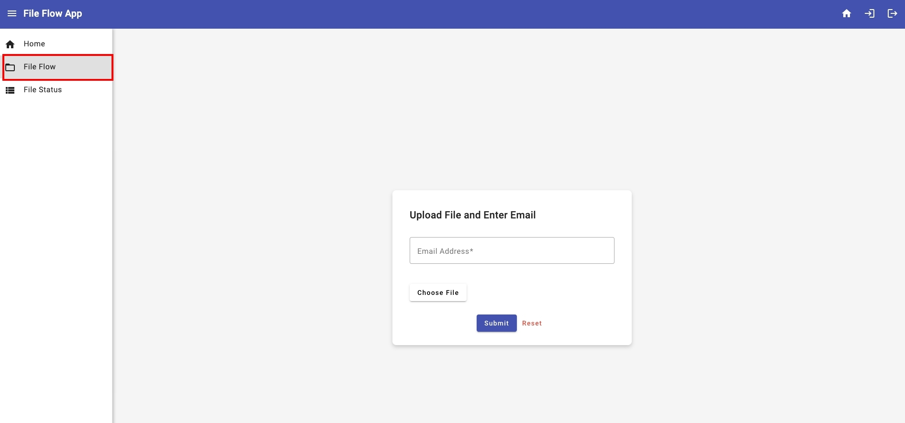
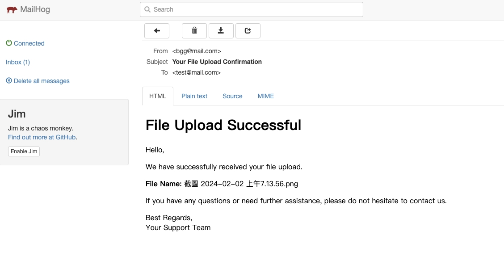
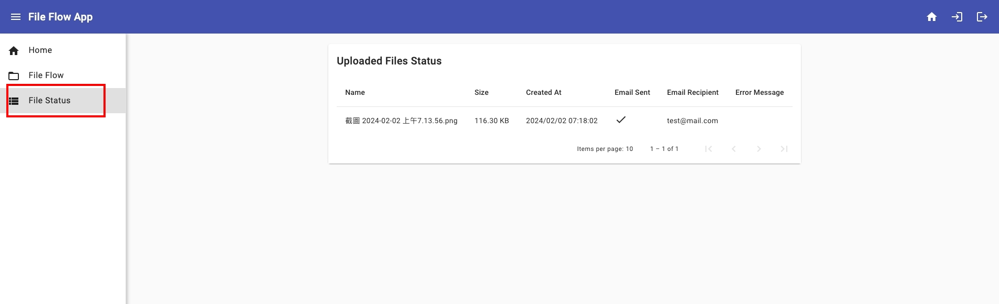

# GoStreamFlow

## Overview
GoStreamFlow is a streamlined system designed for efficient processing of files and emails using Go (Golang). This platform excels in managing file uploads and automating email distribution tasks, offering a comprehensive workflow from user interface to execution.

## Key Features

- Clean Architecture: 
  
  The backbone for scalable and maintainable applications, ensuring clear separation of concerns.
- API Development with Gin: 

  Essential for leveraging Go's strengths in building efficient, scalable web services.
- Unit Testing: 
  
  Crucial for code quality and reliability, a must-have in the Go development workflow.
- Logging with zerolog: 
  
  Key for application monitoring and debugging, optimizing Go's performance and concurrency capabilities.
- RabbitMQ Integration: 
  
  Vital for asynchronous processing and decoupling system components, enhancing scalability.
- PostgreSQL Integration with pgx:

  Important for performance-optimized database interactions, showcasing advanced Go database handling.
- Configuration Management with cleanenv: 
  
  Fundamental for application flexibility and easy management.
- Session Management with gin-session: 
  
  Essential for securing user sessions and managing authentication.
- Swagger Documentation Generation: 
  
  Improves API usability and developer experience through interactive documentation.
- MailHog Integration: 
  
  Useful for safe email testing in development environments, without affecting real servers.
- Integration Testing with Dockertest: 
  
  Supports realistic testing environments, crucial for verifying integrated system performance.

## Components:
1. **Frontend App - FileFlowUI**: 
   - A modern Angular application where users can upload files and enter email information.
   - Directly interacts with GoFlowGateway for initiating file and email processing.

2. **Golang Application - GoFlowGateway**: 
   - A versatile application that incorporates the functionalities of file processing and email distribution.
   - Handles files and email data from FileFlowUI, manages records, interfaces with RabbitMQ for messaging, and oversees the email distribution process.

## Workflow:
- User Signs Up/Signs In on FileFlowUI:

   Users register and log in through the FileFlowUI before accessing the file upload and email submission features.
   

- File Upload and Email Submission:

   Authenticated users upload files and submit email details on FileFlowUI.
   
- GoFlowGateway Processes Data:

   Handles authentication, receives files and email data from FileFlowUI, manages records, and interfaces with RabbitMQ.
- RabbitMQ for Messaging:

   GoFlowGateway sends file and email data to RabbitMQ.
- Email Distribution via MailHog:

   GoFlowGateway consumes messages from RabbitMQ and sends the file to recipients using MailHog instead of a direct email distribution.
   
- Status Update and Tracking:

   GoFlowGateway updates the job status in RabbitMQ.
   Users track the status of file uploads and email dispatches on FileFlowUI, now with the knowledge that emails are sent to MailHog for capture.
   

## How to Get Started
This section will guide you through setting up GoStreamFlow on your system. Follow these steps to quickly get the system running.

### Prerequisites
Before you begin, ensure you have the following installed on your system:

- Docker and Docker Compose: For container management and orchestration.
- Go (Golang): Required for building the GoFlowGateway application.
- Git: For cloning the repository to your local machine.

### Installation & Setup

- Clone the Repository

   ```bash
   git clone https://github.com/BillYang3416/go-stream-flow.git
   ```

- Run the build script in root of project dictionary

   ```bash
   ./build.sh
   ```

- click here to explore [GoStreamFlow](http://localhost) in your local machine

### Next Steps
After setting up, you're ready to use GoStreamFlow for managing file uploads and automating email distribution tasks. Explore the FileFlowUI to upload files and submit email details for processing.